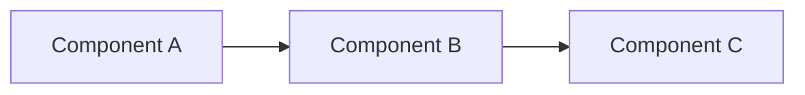

# Technical Specification: [Feature Name]

**Version**: 1.0
**Date**: YYYY-MM-DD
**Author**: System Architect
**Status**: [Draft | Review | Approved | Implemented]

## Overview

### Summary
One paragraph describing what this feature does and why it's needed.

### Goals
- Primary goal
- Secondary goal
- Non-goals (what this explicitly does NOT do)

### Background
Link to PRD or feature request. Brief context on why this is being built.

## Architecture

### System Diagram



### Components Affected
| Component | Changes Required |
|-----------|-----------------|
| Chrome Extension | Description of changes |
| Backend API | Description of changes |
| Database | Description of changes |

### Data Flow

1. Step 1: User does X
2. Step 2: Component A receives Y
3. Step 3: Component B processes Z
4. Step 4: Result returned to user

## API Design

### New Endpoints

#### `POST /api/v1/endpoint-name`

**Purpose**: What this endpoint does

**Request**:
```json
{
  "field1": "string",
  "field2": 123
}
```

**Response (200 OK)**:
```json
{
  "id": "string",
  "result": "string"
}
```

**Error Responses**:
| Code | Description |
|------|-------------|
| 400 | Invalid request body |
| 401 | Authentication required |
| 404 | Resource not found |

### Modified Endpoints

List any existing endpoints that change.

## Data Model

### New Tables/Collections

```sql
CREATE TABLE new_table (
    id TEXT PRIMARY KEY,
    field1 TEXT NOT NULL,
    field2 INTEGER DEFAULT 0,
    created_at INTEGER NOT NULL,
    updated_at INTEGER NOT NULL
);

CREATE INDEX idx_new_table_field1 ON new_table(field1);
```

### Schema Changes

```sql
-- Migration: NNNN_add_field_to_existing.sql
ALTER TABLE existing_table ADD COLUMN new_field TEXT;
```

## Security Considerations

### Authentication
- What auth is required?
- Any special permissions needed?

### Data Handling
- What sensitive data is involved?
- How is it encrypted/protected?

### Validation
- What input validation is required?
- What are the constraints?

## Error Handling

### Error Cases

| Scenario | Error Code | User Message | System Action |
|----------|------------|--------------|---------------|
| Invalid input | 400 | "Invalid X provided" | Log warning |
| Service unavailable | 503 | "Try again later" | Log error, alert |

### Retry Strategy
- Is retry appropriate?
- What's the backoff strategy?

## Testing Strategy

### Unit Tests
- Component A: test X, Y, Z
- Component B: test A, B, C

### Integration Tests
- Test end-to-end flow
- Test error conditions

### Manual Testing
Checklist for QA:
- [ ] Test case 1
- [ ] Test case 2
- [ ] Test case 3

## Implementation Plan

### Phase 1: Foundation
1. Task: Description (estimate)
2. Task: Description (estimate)

### Phase 2: Core Feature
1. Task: Description (estimate)
2. Task: Description (estimate)

### Phase 3: Polish
1. Task: Description (estimate)

### Dependencies
- Blocked by: [Other feature/task]
- Blocks: [Other feature/task]

## Rollout Plan

### Feature Flags
- Flag name: `feature_xyz_enabled`
- Default: false
- Rollout: 10% → 50% → 100%

### Monitoring
- Key metrics to watch
- Alert thresholds

### Rollback
How to disable if issues occur.

## Open Questions

1. Question about X?
   - **Decision**: TBD

2. Question about Y?
   - **Decision**: TBD

## Appendix

### Related Documents
- [PRD Link]
- [Design Mock Link]
- [Related ADR]

### Glossary
- **Term**: Definition

---

## Template Usage Notes

1. **Fill what's relevant**: Not every section applies to every feature
2. **Delete unused sections**: Remove sections marked N/A
3. **Link to tasks**: Once approved, link to implementation tasks
4. **Version updates**: Increment version when spec changes post-approval
5. **Status flow**: Draft → Review → Approved → Implemented
